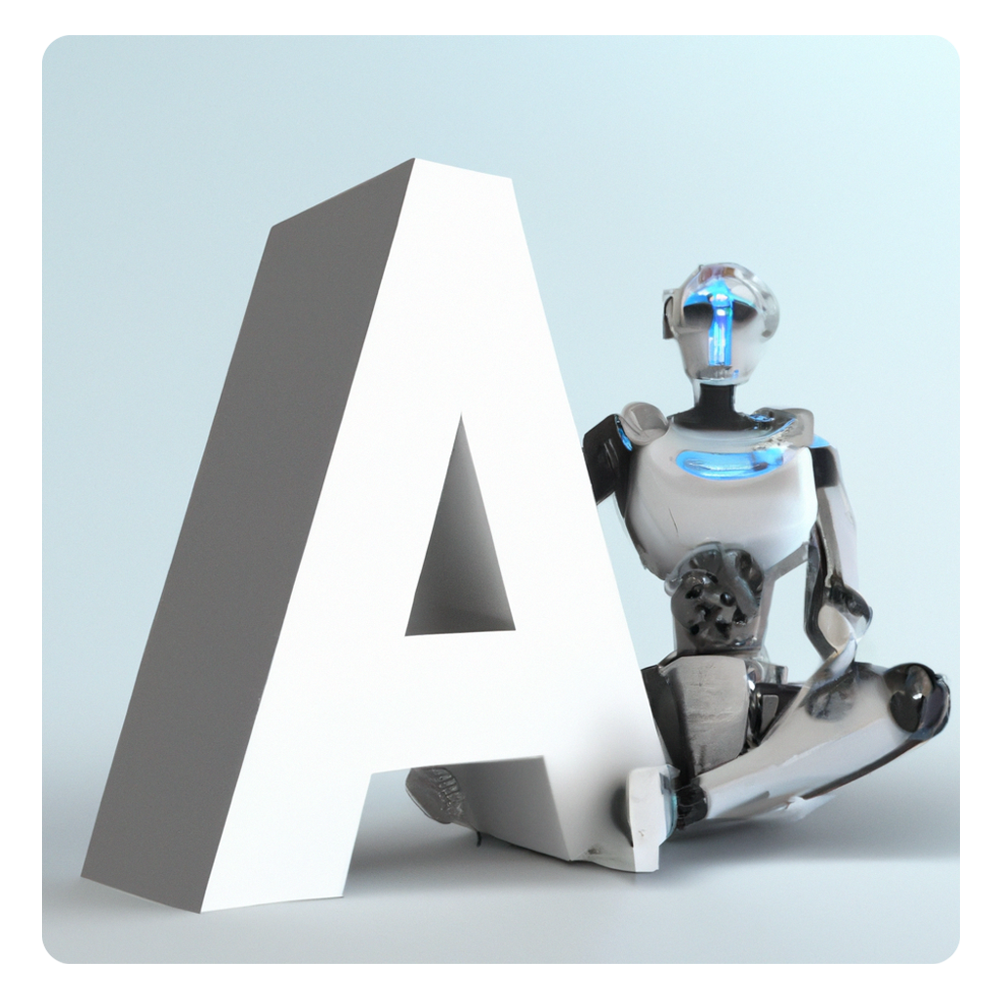

### Hi there 👋 this is my GitHub!

<!--
**AlessandroRedi/AlessandroRedi** is a ✨ _special_ ✨ repository because its `README.md` (this file) appears on your GitHub profile.

Here are some ideas to get you started:

- 🔭 I’m currently working on ...
- 🌱 I’m currently learning ...
- 👯 I’m looking to collaborate on ...
- 🤔 I’m looking for help with ...
- 💬 Ask me about ...
- 📫 How to reach me: ...
- 😄 Pronouns: ...
- ⚡ Fun fact: ...
-->

I'm Alessandro, here you can get some information about me:
- 🎓 I'm a Master's degree student at Politecnico di Torino in Italy in Mechatronic Engineering.
- 🔭 I'm interested in Robotics, Electronics, Machine Learning, etc...
- ⚡ I really like to try new programming languages and learn new things.

Here below there are some of my projects!

If you want to reach out...
</a> 

   
  
  

